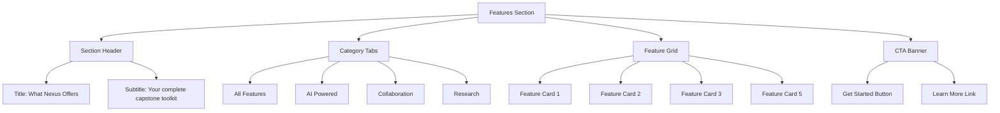

# Features Section PRD - Nexus Platform Features

## Product Requirements Document

**Feature ID:** FEAT-SEC-001  
**Feature Name:** Features Section Content Specification  
**Component Location:** `/html/body/main/section[id="features"]`  
**Status:** Planning Phase  
**Priority:** High  
**Version:** 1.0

---

## 1. Feature Overview

### 1.1 Purpose

The Features section serves as the central showcase of Nexus's core capabilities. When users click the "Features" navigation button (`<a href="#features">`), they should encounter a comprehensive, visually compelling display of platform features that demonstrates value and encourages exploration. This section bridges the gap between initial interest and conversion by providing detailed information about what makes Nexus unique.

### 1.2 Design System Alignment

All features content must adhere to the Nexus "Collaborative Canvas" aesthetic defined in Design.md and DesignPRD.md:

- **Primary Color:** `--crimson` (#b30909) for key highlights and actions
- **Secondary Color:** `--sunny` (#ffd166) for optimism and success indicators
- **AI Accent:** `--teal` (#06d6a0) for AI-related features
- **Typography:** `--font-heading` (Poppins) for headings, `--font-body` (Inter) for descriptions
- **Visual Style:** Organic shapes, hand-drawn elements, asymmetric layouts

### 1.3 User Impact

- **Primary Users:** Prospective students, team collaborators, educators evaluating the platform
- **Use Cases:** Feature discovery, comparison with alternatives, understanding AI capabilities
- **Success Metrics:** Increased time on page, reduced bounce rate, improved sign-up conversion

---

## 2. Feature Categories

### 2.1 Category Structure

The Features section should be organized into the following categories based on existing components and user personas:

| Category              | Priority | Color Theme  | Key Message                           |
| --------------------- | -------- | ------------ | ------------------------------------- |
| AI-Powered Mentorship | High     | `--teal`     | "Your intelligent research companion" |
| Team Collaboration    | High     | `--crimson`  | "Work together, succeed together"     |
| Project Management    | Medium   | `--crimson`  | "Structure meets flexibility"         |
| Research Tools        | Medium   | `--sunny`    | "From chaos to clarity"               |
| Dashboard & Analytics | Low      | `--gray-600` | "Know your progress"                  |

### 2.2 Category Descriptions

#### 2.2.1 AI-Powered Mentorship (Primary Feature)

**Location:** First section (highest priority)

**Feature Components:**

| Component             | Description                                            | Design Spec                                                                              |
| --------------------- | ------------------------------------------------------ | ---------------------------------------------------------------------------------------- |
| The Guide Avatar      | Animated geometric teal shape with pulsing animation   | 256x256px, `pulse-organic` animation, `border-radius: 40% 60% 40% 60% / 60% 40% 60% 40%` |
| Chat Interface Mockup | Interactive chat demonstration showing AI capabilities | 2-column layout, teal chat bubbles, 200ms transitions                                    |
| Capability Highlights | Grid of AI features with icons                         | 4-column grid, teal accent borders, hover lift effect                                    |

**Key Features to Showcase:**

- Research advisor (source finding, citation help)
- Writing assistant (structure, clarity, grammar)
- Methodology guidance (research design, survey creation)
- Progress tracking (milestone suggestions, deadline reminders)

**Visual Elements:**

```css
/* AI Section Background */
.features-ai-section {
  background: linear-gradient(
    180deg,
    var(--canvas) 0%,
    rgba(6, 214, 160, 0.05) 100%
  );
}

/* Guide Avatar Glow */
.the-guide-glow {
  background: rgba(6, 214, 160, 0.1);
  filter: blur(24px);
  animation: pulse-organic 4s infinite;
}
```

#### 2.2.2 Team Collaboration (Secondary Feature)

**Location:** Second section

**Feature Components:**

| Component            | Description                                      | Design Spec                                           |
| -------------------- | ------------------------------------------------ | ----------------------------------------------------- |
| Project Wall Mockup  | Visual representation of collaborative workspace | 5-column grid, corkboard background, pinned cards     |
| Team Member Avatars  | Circular avatars showing collaboration           | 48x48px, border-2 border-white, overlapping positions |
| Real-time Indicators | Cursors, status dots, activity feeds             | Animated floating elements, teal/crimson accents      |

**Key Features to Showcase:**

- Shared digital workspace
- Task assignment and tracking
- Real-time collaboration (cursors, presence)
- Communication tools (comments, mentions)
- Version control for documents

**Visual Elements:**

```css
/* Corkboard Background */
.project-wall-corkboard {
  background-image: radial-gradient(#e5e7eb 1px, transparent 1px);
  background-size: 20px 20px;
  opacity: 0.4;
}

/* Pinned Card */
.pinned-card {
  border-radius: 8px;
  box-shadow: 0 4px 6px -1px rgb(0 0 0 / 0.1);
  transform: rotate(1deg);
  transition: all 200ms ease;
}

.pinned-card:hover {
  transform: rotate(0deg) translateY(-4px);
}
```

#### 2.2.3 Project Management (Tertiary Feature)

**Location:** Third section

**Feature Components:**

| Component              | Description                                | Design Spec                                  |
| ---------------------- | ------------------------------------------ | -------------------------------------------- |
| Task Board             | Kanban-style task organization             | 4-column grid, drag-drop visual indicators   |
| Progress Visualization | Progress rings, completion charts          | SVG-based, sunny yellow accents              |
| Deadline Widget        | Upcoming deadlines with urgency indicators | Card layout, crimson border for urgent items |

**Key Features to Showcase:**

- Gantt chart timeline views
- Task dependencies and milestones
- Automated deadline reminders
- Progress tracking and analytics
- Template library for common project types

#### 2.2.4 Research Tools (Supporting Feature)

**Location:** Fourth section

**Feature Components:**

| Component          | Description                               | Design Spec                      |
| ------------------ | ----------------------------------------- | -------------------------------- |
| Source Collection  | Visual representation of research library | Grid of document cards, sortable |
| Citation Generator | Citation formatting demonstration         | Modal or sidebar preview         |
| Literature Review  | Organized reference management            | Tree-view or network diagram     |

**Key Features to Showcase:**

- AI-powered source discovery
- Automatic citation generation (APA, MLA, Chicago)
- PDF annotation and highlighting
- Research note organization
- Collaboration on literature reviews

---

## 3. Feature Card Specifications

### 3.1 Card Anatomy

Each feature should be presented in a consistent card format:

```typescript
interface FeatureCard {
  // Visual Elements
  icon: React.ReactNode; // Lucide icon or custom SVG
  iconColor: string; // CSS color variable
  backgroundColor: string; // Card background

  // Content
  title: string; // Feature name (Poppins, bold)
  subtitle: string; // Brief description (Inter, gray-600)
  description: string; // Detailed explanation

  // Interactive Elements
  ctaButton?: {
    text: string;
    href: string;
    variant: "primary" | "secondary" | "outline" | "ghost";
  };

  // Visual Effects
  animation?: "pulse" | "float" | "bounce" | "sparkle";
  rotation?: number; // Slight rotation for organic feel
}
```

### 3.2 Card Design System

```css
/* Base Feature Card */
.feature-card {
  background: white;
  border: 1px solid #e5e7eb;
  border-radius: 12px;
  padding: 24px;
  transition: all 200ms ease;
  cursor: pointer;
}

/* Card Hover State */
.feature-card:hover {
  box-shadow: 0 10px 15px -3px rgb(0 0 0 / 0.1);
  transform: translateY(-4px);
  border-color: var(--teal);
}

/* Card Header */
.feature-card-header {
  display: flex;
  align-items: center;
  gap: 12px;
  margin-bottom: 16px;
}

/* Card Icon */
.feature-card-icon {
  width: 48px;
  height: 48px;
  border-radius: 12px;
  display: flex;
  align-items: center;
  justify-content: center;
}

/* Card Title */
.feature-card-title {
  font-family: var(--font-heading);
  font-weight: 700;
  font-size: 1.25rem;
  color: var(--gray-900);
}

/* Card Description */
.feature-card-description {
  font-family: var(--font-body);
  font-weight: 400;
  font-size: 1rem;
  color: var(--gray-600);
  line-height: 1.6;
}
```

### 3.3 Feature Card Variants

| Variant       | Use Case                    | Icon Background | Border         | CTA            |
| ------------- | --------------------------- | --------------- | -------------- | -------------- |
| AI Features   | The Guide, Research Advisor | `--teal`/10     | `--teal`/20    | Teal button    |
| Collaboration | Team workspace, Cursors     | `--crimson`/10  | `--crimson`/20 | Crimson button |
| Management    | Tasks, Deadlines            | `--sunny`/20    | `--sunny`/50   | Sunny button   |
| Research      | Citations, Sources          | `--gray-100`    | `--gray-200`   | Outline button |

---

## 4. Section Layout Specifications

### 4.1 Section Structure



### 4.2 Grid System

```css
/* Features Grid */
.features-grid {
  display: grid;
  gap: 1.5rem;
  grid-template-columns: 1fr;
}

@media (min-width: 768px) {
  .features-grid {
    grid-template-columns: repeat(2, 1fr);
  }
}

@media (min-width: 1024px) {
  .features-grid {
    grid-template-columns: repeat(3, 1fr);
  }
}

/* Featured Hero Card (spans 2 columns) */
.feature-hero {
  grid-column: span 2;
}

@media (max-width: 767px) {
  .feature-hero {
    grid-column: span 1;
  }
}
```

### 4.3 Spacing System

```css
/* Section Spacing */
.features-section {
  padding: 6rem 0;
}

/* Category Spacing */
.features-category {
  margin-bottom: 4rem;
}

/* Card Spacing */
.feature-card {
  padding: 2rem;
  margin-bottom: 1.5rem;
}
```

---

## 5. Interaction Specifications

### 5.1 Scroll Behavior

```typescript
// Smooth scroll to features section
document.querySelector('a[href="#features"]').addEventListener("click", (e) => {
  e.preventDefault();
  const target = document.getElementById("features");
  target.scrollIntoView({ behavior: "smooth", block: "start" });
});
```

### 5.2 Hover Effects

```css
/* Card Hover Animation */
.feature-card {
  transition: all 200ms ease;
}

.feature-card:hover {
  transform: translateY(-4px) rotate(0deg);
  box-shadow: 0 20px 25px -5px rgb(0 0 0 / 0.1);
}

/* Icon Hover */
.feature-card-icon {
  transition: all 200ms ease;
}

.feature-card:hover .feature-card-icon {
  transform: scale(1.1);
  animation: pulse-organic 2s infinite;
}

/* Button Hover */
.feature-card-cta {
  transition: all 200ms ease;
}

.feature-card-cta:hover {
  transform: translateX(4px);
}
```

### 5.3 Scroll Animations

```css
/* Fade in on scroll */
.feature-card {
  opacity: 0;
  transform: translateY(20px);
  animation: fadeInUp 0.6s ease forwards;
}

@keyframes fadeInUp {
  to {
    opacity: 1;
    transform: translateY(0);
  }
}

/* Stagger animation for grid items */
.feature-card:nth-child(1) {
  animation-delay: 0ms;
}
.feature-card:nth-child(2) {
  animation-delay: 100ms;
}
.feature-card:nth-child(3) {
  animation-delay: 200ms;
}
.feature-card:nth-child(4) {
  animation-delay: 300ms;
}
.feature-card:nth-child(5) {
  animation-delay: 400ms;
}
.feature-card:nth-child(6) {
  animation-delay: 500ms;
}
```

### 5.4 Micro-interactions

```css
/* Success Checkmark */
.feature-complete::after {
  content: "✓";
  position: absolute;
  top: 8px;
  right: 8px;
  width: 20px;
  height: 20px;
  background: var(--sunny);
  border-radius: 50%;
  display: flex;
  align-items: center;
  justify-content: center;
  font-size: 12px;
  animation: bounce 0.5s ease;
}

/* Sparkle Effect */
.feature-sparkle {
  position: relative;
}

.feature-sparkle::before {
  content: "";
  position: absolute;
  top: -4px;
  right: -4px;
  width: 12px;
  height: 12px;
  background: var(--teal);
  border-radius: 50%;
  animation: sparkle 1.5s ease infinite;
}
```

---

## 6. Content Specifications

### 6.1 Feature Descriptions

#### AI-Powered Mentorship

| Feature            | Title                         | Description                                                                                          | Icon       |
| ------------------ | ----------------------------- | ---------------------------------------------------------------------------------------------------- | ---------- |
| Research Advisor   | "Smart Source Discovery"      | AI-powered search through academic databases with relevance scoring and citation quality indicators. | BookOpen   |
| Writing Assistant  | "Structure Your Thoughts"     | Real-time suggestions for improving clarity, flow, and academic rigor in your writing.               | PenTool    |
| Methodology Guide  | "Research Design Made Simple" | Step-by-step guidance for choosing and implementing research methods appropriate to your field.      | Compass    |
| Progress Companion | "Never Lose Momentum"         | Intelligent nudges and milestone suggestions to keep your project on track.                          | TrendingUp |

#### Team Collaboration

| Feature           | Title                   | Description                                                                                           | Icon          |
| ----------------- | ----------------------- | ----------------------------------------------------------------------------------------------------- | ------------- |
| Shared Workspace  | "Your Digital Campus"   | Real-time collaborative environment where team members can work simultaneously on shared documents.   | Users         |
| Task Management   | "Who Does What"         | Clear task assignment with progress tracking, dependencies, and automatic workload balancing.         | CheckSquare   |
| Communication Hub | "Stay in Sync"          | Integrated messaging, comments, and mentions that keep everyone aligned without leaving the platform. | MessageCircle |
| Version Control   | "No More Version Chaos" | Automatic version history with diff visualization and the ability to restore previous states.         | GitBranch     |

#### Project Management

| Feature            | Title                   | Description                                                                                   | Icon     |
| ------------------ | ----------------------- | --------------------------------------------------------------------------------------------- | -------- |
| Timeline Views     | "See the Big Picture"   | Gantt charts and timeline views that make project milestones and dependencies visually clear. | Calendar |
| Deadline Tracking  | "Never Miss a Deadline" | Smart deadline management with automated reminders and escalation workflows.                  | Clock    |
| Progress Analytics | "Know Where You Stand"  | Visual progress tracking with insights into team velocity and individual contributions.       | BarChart |
| Templates          | "Start Strong"          | Pre-built templates for common capstone project structures across different disciplines.      | FileText |

#### Research Tools

| Feature            | Title                          | Description                                                                              | Icon       |
| ------------------ | ------------------------------ | ---------------------------------------------------------------------------------------- | ---------- |
| Citation Generator | "Perfect Citations Every Time" | Automatic citation generation in APA, MLA, Chicago, and Harvard formats from DOI or URL. | Citation   |
| PDF Management     | "Organize Your Sources"        | Built-in PDF viewer with annotation, highlighting, and organizational tools.             | FileText   |
| Literature Mapping | "See the Connections"          | Visual network diagrams showing relationships between sources and research themes.       | Network    |
| Note Taking        | "Capture Every Insight"        | Rich text notes linked to sources with powerful search and organization capabilities.    | StickyNote |

### 6.2 Call-to-Action Copy

```typescript
// Primary CTA
const primaryCTA = {
  text: "Start Your Free Trial",
  variant: "primary",
  href: "/register",
};

// Secondary CTA
const secondaryCTA = {
  text: "Watch Demo Video",
  variant: "outline",
  href: "/demo",
};

// Tertiary CTA
const tertiaryCTA = {
  text: "Compare Plans",
  variant: "ghost",
  href: "/pricing",
};
```

---

## 7. Accessibility Requirements

### 7.1 WCAG 2.1 Compliance

```typescript
// Keyboard Navigation
<FeatureCard
  tabIndex={0}
  role="button"
  aria-label={`Feature: ${title}`}
  aria-describedby={`feature-${id}-description`}
  onKeyDown={(e) => e.key === 'Enter' && handleSelect()}
/>

// Focus States
.feature-card:focus {
  outline: 2px solid var(--teal);
  outline-offset: 2px;
}

// Reduced Motion
@media (prefers-reduced-motion: reduce) {
  .feature-card {
    animation: none;
    transition: none;
  }
}
```

### 7.2 Screen Reader Support

```typescript
// Icon Descriptions
<LucideIcon
  aria-hidden="false"
  aria-label={`${feature} icon`}
/>

// Live Regions for Dynamic Content
<div
  role="status"
  aria-live="polite"
  aria-atomic="true"
>
  {notification}
</div>
```

### 7.3 Color Contrast

| Element             | Foreground   | Background  | Contrast Ratio |
| ------------------- | ------------ | ----------- | -------------- |
| Card Title          | `--gray-900` | White       | 15:1 ✓         |
| Card Description    | `--gray-600` | White       | 5.4:1 ✓        |
| AI Feature Title    | `--teal`     | `--teal`/10 | 7.1:1 ✓        |
| Crimson Button Text | White        | `--crimson` | 5.8:1 ✓        |

---

## 8. Responsive Design

### 8.1 Breakpoint Specifications

```css
/* Mobile (< 640px) */
@media (max-width: 639px) {
  .features-grid {
    grid-template-columns: 1fr;
  }

  .feature-card {
    padding: 1.5rem;
  }

  .features-section {
    padding: 3rem 1rem;
  }
}

/* Tablet (640px - 1024px) */
@media (min-width: 640px) and (max-width: 1023px) {
  .features-grid {
    grid-template-columns: repeat(2, 1fr);
  }

  .feature-hero {
    grid-column: span 2;
  }
}

/* Desktop (> 1024px) */
@media (min-width: 1024px) {
  .features-grid {
    grid-template-columns: repeat(3, 1fr);
  }

  .feature-hero {
    grid-column: span 2;
  }
}
```

### 8.2 Touch Targets

```css
/* Minimum Touch Target */
.feature-card-cta {
  min-height: 44px;
  min-width: 44px;
  display: flex;
  align-items: center;
  justify-content: center;
}

/* Spacing Between Cards */
@media (max-width: 767px) {
  .feature-card {
    margin-bottom: 1rem;
  }
}
```

---

## 9. Performance Requirements

### 9.1 Loading Strategy

```typescript
// Lazy load feature images
<Image
  src={feature.image}
  alt={feature.title}
  loading="lazy"
  placeholder="blur"
/>;

// Code split feature sections
const AIFeaturesSection = dynamic(() => import("./AIFeaturesSection"), {
  loading: () => <Skeleton />,
});
```

### 9.2 Animation Performance

```css
/* Use transform and opacity for animations */
.feature-card {
  will-change: transform, opacity;
  transform: translateZ(0);
}

/* Avoid animating layout properties */
.feature-card {
  /* ✓ Good */
  transform: translateY(-4px);
  opacity: 0.9;

  /* ✗ Avoid */
  width: 100%;
  height: auto;
}
```

### 9.3 Bundle Impact

- **Features Section JS:** < 5KB gzipped
- **Feature Icons:** < 3KB gzipped (using Lucide icons)
- **Animations CSS:** < 2KB gzipped

---

## 10. Testing Requirements

### 10.1 Visual Regression Tests

| Test Case                              | Expected Result                          |
| -------------------------------------- | ---------------------------------------- |
| All feature cards in default state     | Correct layout, colors, typography       |
| All feature cards in hover state       | Hover effects visible, animations smooth |
| Feature cards at all breakpoints       | Responsive layout correct                |
| Feature section with long descriptions | Text truncation or scrolling works       |
| Feature section with many features     | Pagination or infinite scroll works      |

### 10.2 Accessibility Tests

| Test Case                   | Tool                    |
| --------------------------- | ----------------------- |
| Color contrast validation   | axe DevTools            |
| Keyboard navigation flow    | Manual testing          |
| Screen reader announcements | NVDA/VoiceOver          |
| Focus indicator visibility  | Manual testing          |
| Reduced motion compliance   | CSS media query testing |

### 10.3 Performance Tests

| Test Case                | Target |
| ------------------------ | ------ |
| First Contentful Paint   | < 1.5s |
| Largest Contentful Paint | < 2.5s |
| Time to Interactive      | < 3.0s |
| Cumulative Layout Shift  | < 0.1  |

---

## 11. Implementation Plan

### Phase 1: Core Structure

- [ ] Create Features section component structure
- [ ] Implement section header with title and subtitle
- [ ] Build category navigation/tabs
- [ ] Set up grid system and responsive breakpoints

### Phase 2: Feature Cards

- [ ] Create base FeatureCard component
- [ ] Implement all card variants (AI, Collaboration, Management, Research)
- [ ] Add hover effects and micro-interactions
- [ ] Implement card animations

### Phase 3: Content Integration

- [ ] Add all feature descriptions and copy
- [ ] Integrate Lucide icons for each feature
- [ ] Create section-specific backgrounds and visual elements
- [ ] Add CTA buttons and links

### Phase 4: Polish & Accessibility

- [ ] Implement keyboard navigation
- [ ] Add screen reader support
- [ ] Test and fix color contrast issues
- [ ] Implement reduced motion support

### Phase 5: Testing & Documentation

- [ ] Write visual regression tests
- [ ] Document component API
- [ ] Performance testing and optimization
- [ ] Cross-browser testing

---

## 12. Success Metrics

### 12.1 User Experience

| Metric                   | Target               | Measurement         |
| ------------------------ | -------------------- | ------------------- |
| Time on Features Section | +30% increase        | Heatmap/Analytics   |
| Scroll Depth             | 80% scroll to bottom | Scroll tracking     |
| Feature Card Click Rate  | > 15% per card       | Click tracking      |
| CTA Conversion Rate      | > 10% to sign-up     | Conversion tracking |

### 12.2 Technical

| Metric               | Target | Measurement       |
| -------------------- | ------ | ----------------- |
| Page Load Time       | < 2s   | Lighthouse        |
| Animation Frame Rate | 60fps  | DevTools          |
| Accessibility Score  | 100%   | axe DevTools      |
| Mobile Performance   | > 90   | Lighthouse Mobile |

---

## 13. Future Enhancements

### 13.1 Roadmap Items

- **Video Demonstrations:** Embedded demo videos for each feature
- **Interactive Demos:** Try-it-now experiences within feature cards
- **Comparison Tables:** Side-by-side comparison with alternatives
- **User Testimonials:** Social proof integration
- **Case Studies:** Real-world success stories

### 13.2 Experimental Features

- **AR/VR Previews:** 3D visualization of workspace
- **Interactive Walkthroughs:** Guided feature tours
- **Personalized Recommendations:** AI-suggested features based on user type

---

## Appendix A: Feature Card Component API

```typescript
// FeatureCard.tsx
interface FeatureCardProps {
  // Content
  title: string;
  description: string;
  icon: LucideIcon;

  // Styling
  variant?: "ai" | "collaboration" | "management" | "research";
  size?: "sm" | "md" | "lg";

  // Interactions
  onClick?: () => void;
  href?: string;

  // Visual Effects
  showSparkle?: boolean;
  rotation?: number;
  animation?: "pulse" | "float" | "bounce";

  // Accessibility
  ariaLabel?: string;
  tabIndex?: number;
}

export const FeatureCard: React.FC<FeatureCardProps>;
```

---

## Appendix B: Color Mapping

```typescript
const featureColors = {
  ai: {
    icon: "var(--teal)",
    background: "rgba(6, 214, 160, 0.1)",
    border: "rgba(6, 214, 160, 0.2)",
    hover: "rgba(6, 214, 160, 0.15)",
  },
  collaboration: {
    icon: "var(--crimson)",
    background: "rgba(179, 9, 9, 0.05)",
    border: "rgba(179, 9, 9, 0.15)",
    hover: "rgba(179, 9, 9, 0.1)",
  },
  management: {
    icon: "var(--sunny)",
    background: "rgba(255, 209, 102, 0.15)",
    border: "rgba(255, 209, 102, 0.3)",
    hover: "rgba(255, 209, 102, 0.25)",
  },
  research: {
    icon: "var(--gray-600)",
    background: "var(--gray-100)",
    border: "var(--gray-200)",
    hover: "var(--gray-50)",
  },
};
```

---

**Document Version:** 1.0  
**Last Updated:** 2026-01-09  
**Next Review:** After Implementation Phase 2
