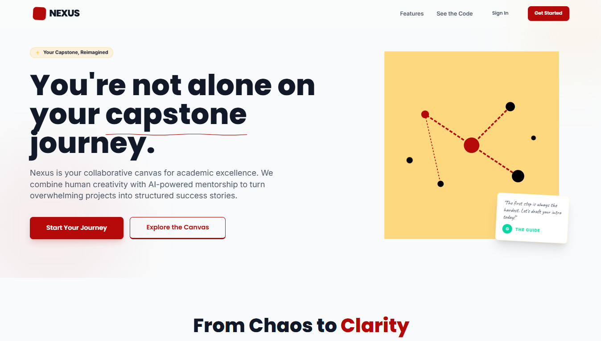
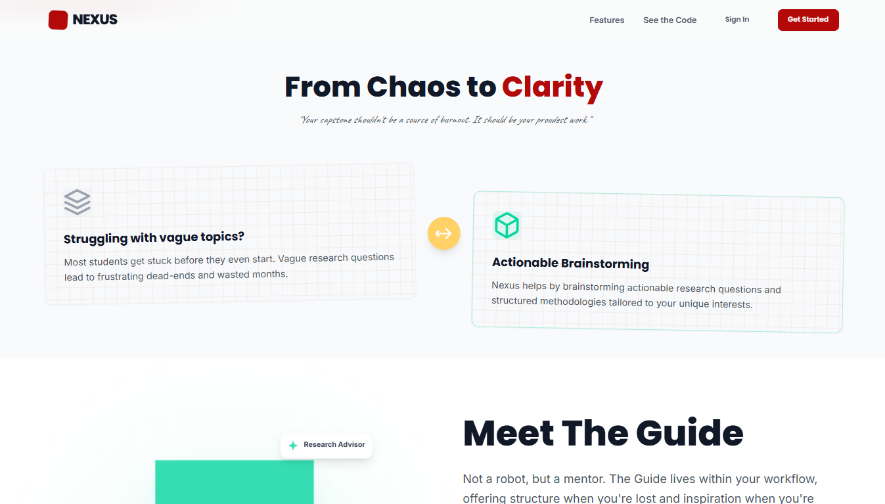
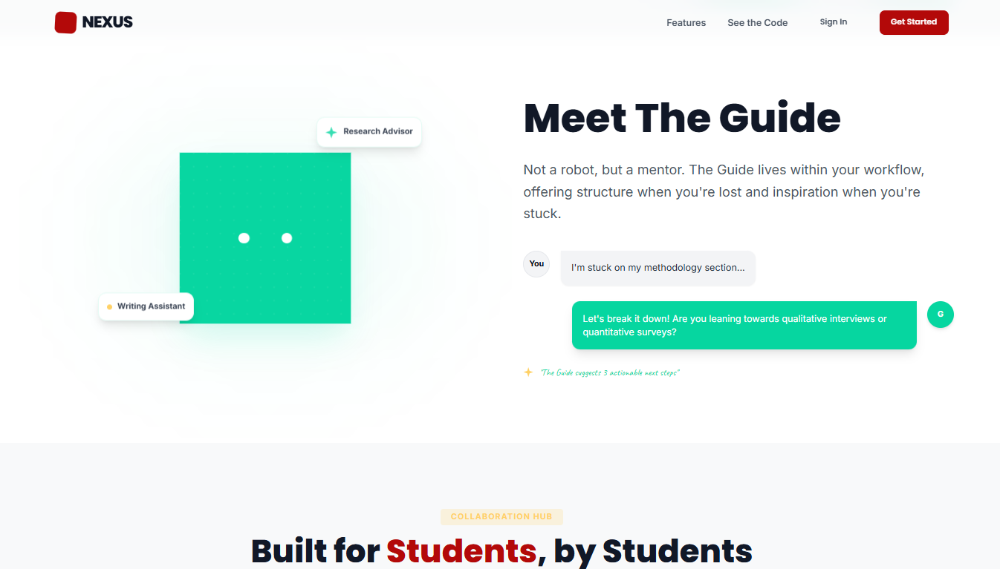
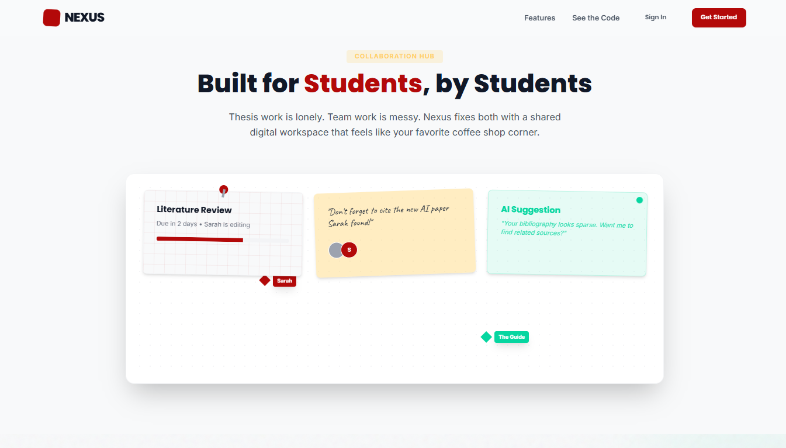
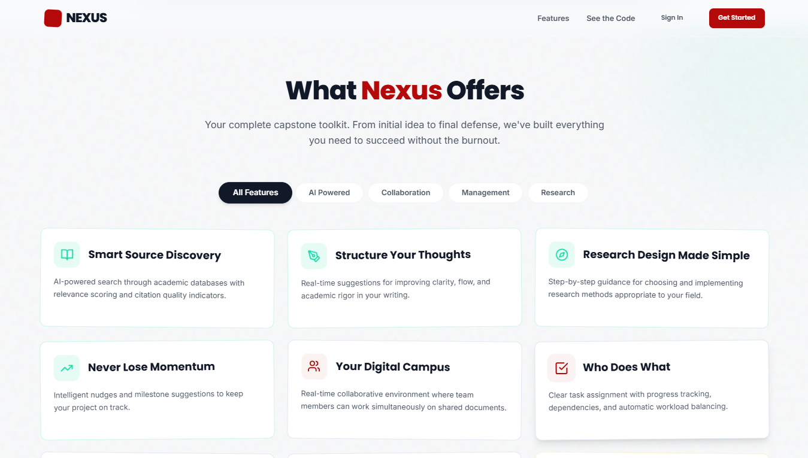

# ✦ Nexus - AI-Powered Capstone Companion

**Your AI-Powered Capstone Companion** - Guiding students through every stage of their capstone projects with intelligent assistance.

## ✦ About Nexus

Nexus is an intelligent web platform designed to guide students through every stage of their capstone projects—from ideation to completion. By leveraging AI capabilities, Nexus provides personalized mentorship, research assistance, project management tools, and collaborative features to help students successfully navigate one of their most challenging academic milestones. The platform includes an AI-powered idea generator, writing assistant, progress analyzer, and comprehensive project management tools with deadline tracking and team collaboration features.

## ✦ Target Audience

- Undergraduate and graduate students working on capstone projects
- Academic institutions looking for student success tools
- Student groups collaborating on team-based capstones

## ✦ Screenshots


_Dashboard Preview_


_Task management with Gantt chart visualization_


_Interactive AI writing assistant_


_Real-time team collaboration features_


_What Nexus Offers_

## ✦ Key Features

### 🤖 AI-Powered Features

- **Idea Generator & Validator**: Generate and validate capstone project ideas with AI assistance
- **Research Assistant**: Get literature review suggestions and research guidance
- **Proposal Writer**: Interactive proposal builder with AI suggestions
- **Methodology Advisor**: Recommendations for research methodologies
- **Progress Analyzer**: Identify bottlenecks and suggest next steps
- **Writing Assistant**: Grammar, style, and academic tone improvements with AI-powered editing
- **The Guide**: Interactive AI companion with visual feedback for different AI states (thinking, celebrating, etc.)

### 📊 Project Management

- **Dashboard**: Visual progress tracking with milestones and project cards
- **Task & Milestone Manager**: Task management with status tracking (TODO, IN_PROGRESS, REVIEW, COMPLETED)
- **Project Tracking**: Track project status across different phases (IDEATION, PROPOSAL, RESEARCH, DEVELOPMENT, WRITING, REVIEW, COMPLETED)
- **Deadline Widget**: Visual deadline tracking and reminders
- **Activity Feed**: Real-time activity tracking for projects

### 👥 Collaboration Features

- **Team Workspaces**: Shared project spaces with role-based permissions (OWNER, ADMIN, MEMBER, VIEWER)
- **Advisor Communication**: Structured feedback request system
- **User Management**: Role-based access control with STUDENT, ADVISOR, and ADMIN roles

### 📚 Resource Library

- **Template Center**: Proposal templates by discipline
- **Knowledge Base**: Best practices and sample projects
- **Video Tutorials**: Step-by-step guidance

### 🔐 Security & Access Control

- **Rate Limiting**: Built-in rate limiting (30 requests per minute per IP)
- **AI Credit System**: Credit-based AI usage tracking with limits
- **Authentication**: Secure authentication with session management
- **Data Validation**: Comprehensive input validation using Zod schemas

## ✦ Technical Stack

### Frontend

- **Next.js** (App Router) with **React 18+**
- **TypeScript** for type safety
- **Tailwind CSS** for responsive design with custom styling
- **TanStack Query** for server state management
- **Zod** for runtime type validation
- **Lucide React** for UI icons
- **React Markdown** for markdown rendering

### Backend

- **Next.js API Routes** for server-side logic
- **MongoDB** with **Prisma ORM** for database management
- **Mistral AI API** (mistral-small-latest) for AI features
- **NextAuth.js** for authentication

### Authentication

- **NextAuth.js** with Google OAuth
- **Email/password authentication** with bcrypt hashing
- **Session management** with secure tokens
- **Prisma Adapter** for database integration

### Security

- **Rate Limiting**: Custom implementation with token bucket algorithm
- **Input Sanitization**: Prompt sanitization to prevent injection attacks
- **Token Estimation**: Built-in token usage tracking
- **Zod Validation**: Comprehensive request validation schemas

## ✦ Project Structure

```
nexus/
├── .coderabbit.yaml         # Code review configuration
├── .env                     # Environment variables
├── .env.local               # Local environment variables
├── .eslintrc.js             # ESLint configuration
├── .gitignore
├── .next/                   # Next.js build output
├── middleware.ts            # Middleware for authentication and security
├── next.config.mjs          # Next.js configuration
├── package.json             # Dependencies and scripts
├── postcss.config.js        # PostCSS configuration
├── tailwind.config.ts       # Tailwind CSS configuration
├── tsconfig.json            # TypeScript configuration
├── prisma/
│   ├── create-ttl-index.js  # MongoDB TTL index creation
│   ├── create-ttl-index.ts  # TypeScript version of TTL index script
│   ├── schema.prisma        # Database schema with MongoDB models
│   └── seed.ts              # Database seeding script
├── public/                  # Static assets
├── src/
│   ├── app/                 # Next.js app router pages
│   │   ├── (auth)/          # Authentication routes
│   │   │   ├── login/
│   │   │   ├── register/
│   │   │   ├── reset-password/
│   │   │   └── verify/
│   │   ├── (dashboard)/     # Dashboard routes with protected layout
│   │   │   ├── capstone-assistant/
│   │   │   ├── chat/
│   │   │   ├── dashboard/
│   │   │   ├── drafts/
│   │   │   └── projects/
│   │   └── api/             # API routes for backend functionality
│   ├── components/          # React components organized by feature
│   ├── config/              # Configuration files
│   ├── emails/              # Email templates for notifications
│   ├── lib/                 # Utility functions and libraries
│   │   ├── actions.ts       # Server actions
│   │   ├── ai.ts            # AI integration with Mistral AI
│   │   ├── auth.ts          # Authentication configuration
│   │   ├── creditLimits.ts  # AI credit limits configuration
│   │   ├── dashboard-data.ts # Dashboard data utilities
│   │   ├── db.ts            # Database connection
│   │   ├── email.ts         # Email sending utilities
│   │   ├── email-queue.ts   # Email queue management
│   │   ├── featureColors.ts # UI color definitions
│   │   ├── featuresData.ts  # Feature data configuration
│   │   ├── logger.ts        # Logging utilities
│   │   ├── prisma.ts        # Prisma client configuration
│   │   ├── rate-limit.ts    # Rate limiting implementation
│   │   ├── utils.ts         # General utility functions
│   │   ├── validation.ts    # Validation utilities
│   │   └── validations/     # Zod validation schemas
│   ├── scripts/             # Utility scripts
│   ├── styles/              # CSS files
│   └── types/               # TypeScript type definitions
```

## ✦ Getting Started

### ✦ Prerequisites

- Node.js 18+
- npm, yarn, or pnpm
- MongoDB Atlas account
- Mistral AI API key
- Google OAuth credentials (for Google login)
- Vercel account (for deployment)

### ✦ Installation

1. Clone the repository:

   ```bash
   git clone https://github.com/JustinReyes28/Nexus.git
   cd Nexus
   ```

2. Install dependencies:

   ```bash
   npm install
   # or
   yarn install
   # or
   pnpm install
   ```

3. Set up environment variables:

   ```bash
   cp .env.example .env.local
   ```

   Update the `.env.local` file with your configuration (see Environment Variables section below)

4. Run database setup (required for fresh installs):

   ```bash
   npx prisma db push    # Syncs the database schema (skip if connecting to pre-existing production DB managed by migrations)
   npx prisma generate   # Builds the Prisma Client for local/dev setups (skip if CI/deployment handles client generation)
   ```

5. Run the development server:
   ```bash
   npm run dev
   # or
   yarn dev
   # or
   pnpm dev
   `
   ```
