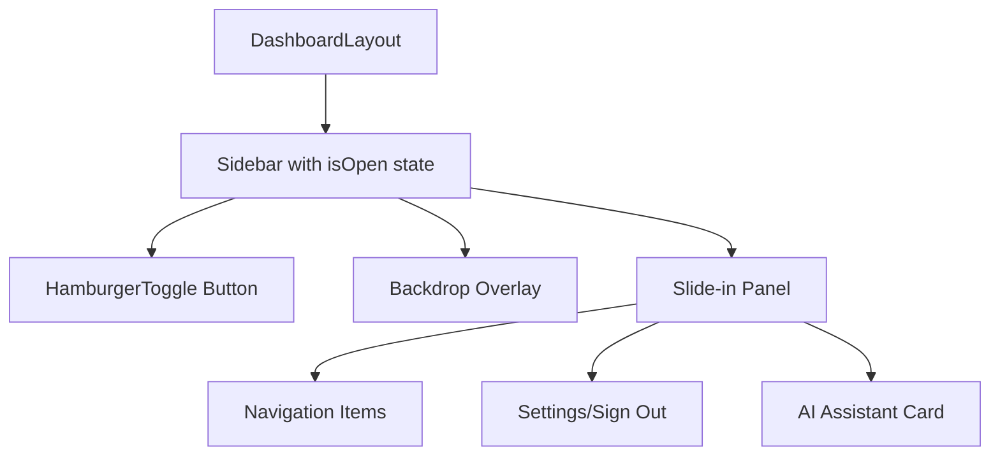

# Implementation Plan: Collapsible Sidebar Transformation

## Executive Summary

Transform the current static [`Sidebar.tsx`](src/components/dashboard/Sidebar.tsx) component into a collapsible/poppable side menu that works responsively across all screen sizes, using patterns established in the existing [`TeamSidebar.tsx`](src/components/dashboard/TeamSidebar.tsx).

---

## 1. Component Architecture Changes

### Current Architecture

- **File**: [`src/components/dashboard/Sidebar.tsx`](src/components/dashboard/Sidebar.tsx:26)
- **Element**: `<aside>` with static 240px width (`w-60`)
- **Visibility**: Hidden on mobile, visible on lg+ screens (`hidden lg:flex`)
- **State**: No internal state management
- **Integration**: Directly rendered in [`DashboardLayout.tsx`](src/components/dashboard/DashboardLayout.tsx:20)

### Proposed Architecture



### Key Changes

| Aspect      | Current               | Proposed                                         |
| ----------- | --------------------- | ------------------------------------------------ |
| Visibility  | Static display on lg+ | Hidden by default, toggled by state              |
| Positioning | Static sidebar layout | Fixed position, off-canvas                       |
| State       | None                  | Internal `isOpen` state                          |
| Control     | None                  | Hamburger button + overlay + escape key          |
| Z-index     | 20                    | 50+ (overlay) / 60 (menu)                        |
| Width       | Fixed 240px           | Responsive: full-width (mobile), 240px (desktop) |

### New Component Structure

```tsx
// src/components/dashboard/Sidebar.tsx (proposed)
"use client";

import React, { useState, useEffect, useCallback } from "react";
import Link from "next/link";
import { usePathname } from "next/navigation";
import { cn } from "@/lib/utils";
import { signOut } from "next-auth/react";
import {
  LayoutDashboard,
  FileText,
  Search,
  Calendar,
  Settings,
  LogOut,
  Sparkle as SparkleIcon,
  Menu,
  X,
} from "lucide-react";

const navItems = [
  { label: "Base Camp", icon: LayoutDashboard, href: "/dashboard" },
  { label: "My Drafts", icon: FileText, href: "/drafts" },
  { label: "Research", icon: Search, href: "/research" },
  { label: "Schedule", icon: Calendar, href: "/schedule" },
];

export default function Sidebar({ className }: { className?: string }) {
  const [isOpen, setIsOpen] = useState(false);
  const pathname = usePathname();

  const handleClose = useCallback(() => {
    setIsOpen(false);
  }, []);

  // Close on escape key
  useEffect(() => {
    const handleEscape = (e: KeyboardEvent) => {
      if (e.key === "Escape") handleClose();
    };
    document.addEventListener("keydown", handleEscape);
    return () => document.removeEventListener("keydown", handleEscape);
  }, [handleClose]);

  // Prevent body scroll when menu is open (mobile only)
  useEffect(() => {
    if (isOpen) {
      document.body.style.overflow = "hidden";
    } else {
      document.body.style.overflow = "";
    }
    return () => {
      document.body.style.overflow = "";
    };
  }, [isOpen]);

  return (
    <>
      {/* Hamburger Toggle Button */}
      <button
        onClick={() => setIsOpen(true)}
        className="fixed top-4 left-4 z-50 lg:hidden p-3 bg-white border-2 border-gray-200
                   rounded-xl hover:border-crimson hover:shadow-md transition-all
                   focus:outline-none focus:ring-2 focus:ring-crimson/20"
        aria-label="Open sidebar menu"
      >
        <Menu className="w-5 h-5 text-gray-700" />
      </button>

      {/* Backdrop Overlay */}
      {isOpen && (
        <div
          className="fixed inset-0 bg-black/30 backdrop-blur-sm z-40
                     transition-opacity duration-300"
          onClick={handleClose}
          aria-hidden="true"
        />
      )}

      {/* Slide-in Panel */}
      <aside
        className={cn(
          "fixed top-0 left-0 z-50 h-full bg-white shadow-xl",
          "flex flex-col py-8 px-6 border-r border-gray-200",
          "transition-transform duration-300 ease-out",
          isOpen ? "translate-x-0" : "-translate-x-full",
          "lg:translate-x-0 lg:static lg:w-60 lg:border-r lg:shadow-none",
          className
        )}
        role="dialog"
        aria-label="Main navigation sidebar"
      >
        {/* Close Button (mobile only) */}
        <button
          onClick={handleClose}
          className="absolute top-4 right-4 p-2 hover:bg-gray-100 rounded-lg
                     transition-colors focus:outline-none focus:ring-2 focus:ring-crimson/20
                     lg:hidden"
          aria-label="Close sidebar"
        >
          <X className="w-5 h-5 text-gray-500" />
        </button>

        {/* Logo/Brand */}
        <Link href="/" className="flex items-center gap-3 mb-12 px-2">
          <div className="w-8 h-8 bg-crimson rounded-lg rotate-3" />
          <span className="text-xl font-heading font-extrabold tracking-tighter text-gray-900">
            NEXUS
          </span>
        </Link>

        {/* Navigation Items */}
        <nav className="flex-1 space-y-2">
          {navItems.map((item) => {
            const isActive = pathname === item.href;
            return (
              <Link
                key={item.href}
                href={item.href}
                className={cn(
                  "group flex items-center gap-3 px-3 py-2 rounded-lg text-sm font-semibold transition-all relative",
                  isActive
                    ? "text-crimson"
                    : "text-gray-500 hover:text-gray-900 hover:bg-gray-50"
                )}
                onClick={handleClose}
              >
                <item.icon
                  className={cn(
                    "w-5 h-5",
                    isActive
                      ? "text-crimson"
                      : "text-gray-400 group-hover:text-gray-900"
                  )}
                />
                {item.label}
                {isActive && (
                  <div className="absolute left-0 w-1 h-6 bg-crimson rounded-r-full" />
                )}
              </Link>
            );
          })}
        </nav>

        {/* Bottom Section */}
        <div className="mt-8 pt-8 border-t border-gray-100 flex flex-col gap-2">
          <Link
            href="/settings"
            className="flex items-center gap-3 px-3 py-2 text-sm font-semibold text-gray-500 hover:text-gray-900 rounded-lg hover:bg-gray-50"
          >
            <Settings className="w-5 h-5 text-gray-400" />
            Settings
          </Link>
          <button
            type="button"
            onClick={() => signOut({ callbackUrl: "/login" })}
            className="flex items-center gap-3 px-3 py-2 text-sm font-semibold text-gray-500 hover:text-crimson rounded-lg hover:bg-red-50 text-left"
          >
            <LogOut className="w-5 h-5 text-gray-400 group-hover:text-crimson" />
            Sign Out
          </button>
        </div>

        {/* "The Guide" Quick Access Card */}
        <div className="mt-8 p-4 bg-teal/5 rounded-xl border border-teal/10 relative overflow-hidden group">
          <div className="absolute top-0 right-0 p-1 opacity-20 transition-opacity group-hover:opacity-100">
            <SparkleIcon className="w-4 h-4 text-teal animate-sparkle" />
          </div>
          <p className="text-[10px] uppercase font-bold text-teal tracking-widest mb-1">
            AI Assistant
          </p>
          <p className="text-xs font-heading font-bold text-gray-900 mb-3">
            Ask The Guide
          </p>
          <button className="w-full py-2 bg-teal text-white rounded-lg text-xs font-bold shadow-sm shadow-teal/20 hover:bg-teal/90 transition-colors">
            Summon Guide
          </button>
        </div>
      </aside>
    </>
  );
}
```

---

## 2. UI/UX Design

### Hamburger Button Placement

**Recommended Location**: Top-left corner (consistent with left sidebar pattern)

```tsx
// Mobile: Top-left hamburger button
<button className="fixed top-4 left-4 z-50 lg:hidden p-3 bg-white border-2 border-gray-200 rounded-xl hover:border-crimson shadow-sm transition-all">
  <Menu className="w-5 h-5 text-gray-700" />
</button>

// Desktop: Keep existing sidebar visible, but make it collapsible
<button className="hidden lg:block fixed top-4 left-4 z-50 p-3 bg-white border-2 border-gray-200 rounded-xl hover:border-crimson shadow-sm transition-all">
  <Menu className="w-5 h-5 text-gray-700" />
</button>
```

### Animation & Transitions

**Recommended**: CSS transitions with Tailwind utility classes

```tsx
// Slide-in from left
<aside className={cn(
  "transition-transform duration-300 ease-out",
  isOpen ? "translate-x-0" : "-translate-x-full",
  "lg:translate-x-0 lg:static"
)}>
```

**Animation Properties**:

- **Duration**: 300ms (consistent with TeamSidebar)
- **Easing**: `ease-out` (smooth deceleration)
- **Transform**: `translate-x` for horizontal movement

### Backdrop/Overlay

```tsx
{
  isOpen && (
    <div
      className="fixed inset-0 bg-black/30 backdrop-blur-sm z-40
                 transition-opacity duration-300
                 lg:hidden"
      onClick={handleClose}
      aria-hidden="true"
    />
  );
}
```

### Z-index Management

| Layer            | Z-index | Purpose            |
| ---------------- | ------- | ------------------ |
| Grain texture    | 0       | Background texture |
| Main content     | 10      | Dashboard content  |
| Sidebar (left)   | 20      | Navigation sidebar |
| Hamburger button | 50      | Toggle button      |
| Backdrop         | 40      | Overlay            |
| Menu panel       | 50      | Slide-in panel     |

### Responsive Behavior

```tsx
// Mobile (< lg): Full-width overlay menu
<aside className="fixed top-0 left-0 z-50 h-full w-full bg-white shadow-xl lg:w-60">

// Desktop (lg+): Slide-in from left edge (240px width)
<aside className="fixed top-0 left-0 z-50 h-full w-60 bg-white shadow-xl lg:static lg:translate-x-0">
```

### Desktop Collapsible Behavior

For desktop, we'll implement a collapsible pattern that maintains the sidebar visible but allows toggling:

```tsx
// Desktop state management
const [isCollapsed, setIsCollapsed] = useState(false);

// Toggle button for desktop
<button
  onClick={() => setIsCollapsed(!isCollapsed)}
  className="hidden lg:block absolute top-4 right-4 p-2 hover:bg-gray-100 rounded-lg transition-colors"
  aria-label={isCollapsed ? "Expand sidebar" : "Collapse sidebar"}
>
  {isCollapsed ? <Menu className="w-5 h-5" /> : <X className="w-5 h-5" />}
</button>

// Collapsed state styling
<aside className={cn(
  "transition-all duration-300 ease-out",
  isCollapsed ? "w-16" : "w-60",
  "lg:static lg:translate-x-0"
)}>
```

---

## 3. Technical Implementation Steps

### Step 1: Update Sidebar Component

**File**: [`src/components/dashboard/Sidebar.tsx`](src/components/dashboard/Sidebar.tsx)

```tsx
// Add necessary imports
import { useState, useEffect, useCallback } from "react";
import { Menu, X } from "lucide-react";

// Add state management
const [isOpen, setIsOpen] = useState(false);
const [isCollapsed, setIsCollapsed] = useState(false);

// Add keyboard and scroll handlers
useEffect(() => {
  const handleEscape = (e: KeyboardEvent) => {
    if (e.key === "Escape") setIsOpen(false);
  };
  document.addEventListener("keydown", handleEscape);
  return () => document.removeEventListener("keydown", handleEscape);
}, []);

useEffect(() => {
  if (isOpen) {
    document.body.style.overflow = "hidden";
  } else {
    document.body.style.overflow = "";
  }
  return () => {
    document.body.style.overflow = "";
  };
}, [isOpen]);

// Wrap component in fragment and add hamburger/button logic
return (
  <>
    {/* Hamburger Toggle Button */}
    <button
      onClick={() => setIsOpen(true)}
      className="fixed top-4 left-4 z-50 lg:hidden p-3 bg-white border-2 border-gray-200 rounded-xl hover:border-crimson hover:shadow-md transition-all focus:outline-none focus:ring-2 focus:ring-crimson/20"
      aria-label="Open sidebar menu"
    >
      <Menu className="w-5 h-5 text-gray-700" />
    </button>

    {/* Backdrop Overlay */}
    {isOpen && (
      <div
        className="fixed inset-0 bg-black/30 backdrop-blur-sm z-40 transition-opacity duration-300 lg:hidden"
        onClick={() => setIsOpen(false)}
        aria-hidden="true"
      />
    )}

    {/* Slide-in Panel */}
    <aside
      className={cn(
        "fixed top-0 left-0 z-50 h-full bg-white shadow-xl",
        "flex flex-col py-8 px-6 border-r border-gray-200",
        "transition-transform duration-300 ease-out",
        isOpen ? "translate-x-0" : "-translate-x-full",
        "lg:translate-x-0 lg:static lg:w-60 lg:border-r lg:shadow-none",
        className
      )}
      role="dialog"
      aria-label="Main navigation sidebar"
    >
      {/* Close Button (mobile only) */}
      <button
        onClick={() => setIsOpen(false)}
        className="absolute top-4 right-4 p-2 hover:bg-gray-100 rounded-lg transition-colors focus:outline-none focus:ring-2 focus:ring-crimson/20 lg:hidden"
        aria-label="Close sidebar"
      >
        <X className="w-5 h-5 text-gray-500" />
      </button>

      {/* Existing content with onClick handlers for mobile */}
      {/* Add onClick={handleClose} to all Link components */}
    </aside>
  </>
);
```

### Step 2: Update DashboardLayout Integration

**File**: [`src/components/dashboard/DashboardLayout.tsx`](src/components/dashboard/DashboardLayout.tsx)

```tsx
// Remove direct sidebar rendering, replace with collapsible version
export default function DashboardLayout({ children }: DashboardLayoutProps) {
  return (
    <div className="flex h-screen bg-canvas font-body overflow-hidden">
      {/* Texture Overlay for the whole dashboard */}
      <div className="fixed inset-0 bg-grain pointer-events-none z-0" />

      {/* Sidebar - now collapsible */}
      <Sidebar />

      {/* Main Content Area (Fluid) */}
      <main className="flex-1 overflow-y-auto relative z-10 px-4 md:px-8 py-8">
        <div className="max-w-5xl mx-auto min-h-full">{children}</div>
      </main>

      {/* TeamSidebar - hamburger menu */}
      <TeamSidebar />
    </div>
  );
}
```

### Step 3: Add Optional Collapse Toggle for Desktop

For enhanced desktop experience, add a collapse/expand toggle:

```tsx
// In Sidebar.tsx, add desktop collapse functionality
const handleToggleCollapse = () => {
  setIsCollapsed(!isCollapsed);
};

// Add collapse button inside sidebar (desktop only)
<button
  onClick={handleToggleCollapse}
  className="hidden lg:block absolute top-4 right-4 p-2 hover:bg-gray-100 rounded-lg transition-colors focus:outline-none focus:ring-2 focus:ring-crimson/20"
  aria-label={isCollapsed ? "Expand sidebar" : "Collapse sidebar"}
>
  {isCollapsed ? (
    <Menu className="w-5 h-5 text-gray-500" />
  ) : (
    <X className="w-5 h-5 text-gray-500" />
  )}
</button>

// Update sidebar width based on collapse state
<aside className={cn(
  "transition-all duration-300 ease-out",
  "lg:static lg:translate-x-0",
  isCollapsed ? "lg:w-16" : "lg:w-60",
  // Add collapsed styling for content
  isCollapsed && "lg:px-2 lg:py-4"
)}>
  {/* Conditionally render text based on collapse state */}
  {!isCollapsed && (
    <span className="text-xl font-heading font-extrabold tracking-tighter text-gray-900">NEXUS</span>
  )}
</aside>
```

---

## 4. Accessibility Considerations

### Keyboard Navigation

- **Escape Key**: Close sidebar when Escape key is pressed
- **Tab Navigation**: Ensure focus remains within sidebar when open
- **Focus Management**: Return focus to toggle button when sidebar closes

```tsx
// Focus management
const toggleButtonRef = useRef<HTMLButtonElement>(null);

useEffect(() => {
  if (!isOpen && toggleButtonRef.current) {
    toggleButtonRef.current.focus();
  }
}, [isOpen]);
```

### ARIA Attributes

```tsx
<aside
  role="dialog"
  aria-label="Main navigation sidebar"
  aria-modal="true"
  aria-hidden={!isOpen}
>

<button
  aria-label={isOpen ? "Close sidebar" : "Open sidebar"}
  aria-expanded={isOpen}
  aria-controls="sidebar-menu"
>
```

### Screen Reader Support

- **Role Attributes**: Proper `role="dialog"` and `aria-label`
- **Live Regions**: Announce state changes
- **Semantic HTML**: Use proper heading structure and landmarks

---

## 5. Testing Checklist

### Responsive Breakpoints

- [ ] Mobile (xs-sm): Full-width overlay menu
- [ ] Tablet (md-lg): Full-width overlay menu
- [ ] Desktop (lg+): Slide-in from left edge
- [ ] Large Desktop (xl+): Collapsible sidebar behavior

### User Interaction Scenarios

- [ ] Click hamburger button opens sidebar
- [ ] Click backdrop closes sidebar (mobile only)
- [ ] Click close button closes sidebar
- [ ] Press Escape key closes sidebar
- [ ] Click navigation links closes sidebar (mobile)
- [ ] Collapse/expand toggle works (desktop)
- [ ] Body scroll is prevented when sidebar open (mobile)

### Visual & Animation Testing

- [ ] Smooth slide-in/out animations
- [ ] Proper backdrop opacity and blur
- [ ] Correct z-index layering
- [ ] No content shifting when sidebar opens/closes
- [ ] Proper shadow and border styling

### Accessibility Testing

- [ ] Keyboard navigation works
- [ ] Screen reader announces correctly
- [ ] Focus management works properly
- [ ] ARIA attributes are correct
- [ ] Color contrast meets WCAG standards

### Cross-Browser Testing

- [ ] Chrome (latest)
- [ ] Firefox (latest)
- [ ] Safari (latest)
- [ ] Edge (latest)

---

## 6. Implementation Phases

### Phase 1: Core Mobile Functionality

1. Add state management to Sidebar component
2. Create hamburger toggle button (mobile only)
3. Implement slide-in animation
4. Add backdrop overlay
5. Update navigation links to close sidebar on click

### Phase 2: Desktop Integration

1. Implement responsive behavior (lg breakpoint)
2. Add static sidebar for desktop
3. Ensure smooth transitions between mobile/desktop
4. Test z-index and positioning

### Phase 3: UX Enhancements

1. Add escape key handler
2. Add body scroll prevention (mobile)
3. Implement focus management
4. Add close button inside menu
5. Add desktop collapse/expand functionality

### Phase 4: Testing & Refinement

1. Test on all screen sizes
2. Verify accessibility compliance
3. Test animations and transitions
4. Check cross-browser compatibility
5. Performance testing

---

## 7. Dependencies & Requirements

### No New Dependencies Required

All required features are already available:

| Feature             | Solution                                       |
| ------------------- | ---------------------------------------------- |
| State management    | React `useState`, `useEffect`                  |
| Icons               | Already using `lucide-react`                   |
| Animations          | Existing Tailwind animations + CSS transitions |
| Styling             | Tailwind CSS (already configured)              |
| Class merging       | `cn()` utility from `@/lib/utils`              |
| Keyboard navigation | Native `document.addEventListener`             |

### Tailwind Configuration

**No changes required** - existing configuration has all needed custom colors and animations.

### TypeScript Considerations

- No new types needed
- Existing props interface can be extended if needed
- All imports are already typed via existing imports

---

## 8. Rollback Plan

If issues arise, revert by:

1. Restoring original `Sidebar.tsx` structure
2. Reverting `DashboardLayout.tsx` changes
3. Removing hamburger button code
4. Restoring static sidebar positioning

---

## 9. Success Metrics

- Sidebar toggles smoothly on mobile devices
- Desktop sidebar remains accessible while being collapsible
- All navigation functionality preserved
- No regression in existing features
- Accessibility compliance maintained
- Performance impact minimal
