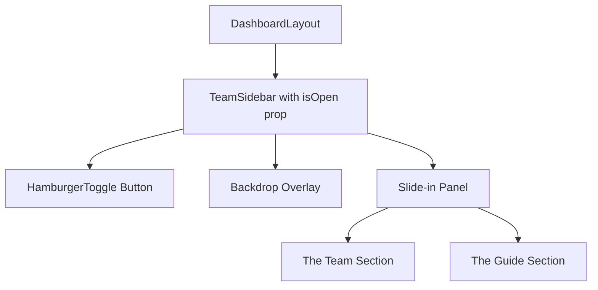

# Implementation Plan: TeamSidebar to Hamburger Menu Conversion

## Executive Summary

Convert the static [`TeamSidebar.tsx`](src/components/dashboard/TeamSidebar.tsx) component into an interactive hamburger menu that slides in from the right side, works on all screen sizes, and preserves all existing content and styling.

---

## 1. Component Architecture Changes

### Current Architecture

- **File**: [`src/components/dashboard/TeamSidebar.tsx`](src/components/dashboard/TeamSidebar.tsx:13)
- **Element**: `<aside>` with static 320px width
- **Visibility**: Hidden on xl screens only (`hidden xl:flex`)
- **State**: No internal state management

### Proposed Architecture



### Key Changes

| Aspect      | Current               | Proposed                                |
| ----------- | --------------------- | --------------------------------------- |
| Visibility  | Static display on xl+ | Hidden by default, toggled by state     |
| Positioning | Static sidebar layout | Fixed position, off-canvas              |
| State       | None                  | Internal `isOpen` state                 |
| Control     | None                  | Hamburger button + overlay + escape key |
| Z-index     | 20                    | 50+ (overlay) / 60 (menu)               |

### New Component Structure

```tsx
// src/components/dashboard/TeamSidebar.tsx (proposed)
"use client";

import React, { useState, useEffect } from "react";
import { cn } from "@/lib/utils";
import { User, MessageCircle, Sparkles, X, Menu } from "lucide-react";

// ... existing teamMembers data ...

export default function TeamSidebar({ className }: { className?: string }) {
  const [isOpen, setIsOpen] = useState(false);

  // Close on escape key
  useEffect(() => {
    const handleEscape = (e: KeyboardEvent) => {
      if (e.key === "Escape") setIsOpen(false);
    };
    document.addEventListener("keydown", handleEscape);
    return () => document.removeEventListener("keydown", handleEscape);
  }, []);

  return (
    <>
      {/* Hamburger Toggle Button */}
      <button
        onClick={() => setIsOpen(true)}
        className="fixed top-4 right-4 z-50 p-2 bg-white border-2 border-gray-200 rounded-lg hover:border-crimson transition-colors"
        aria-label="Open team sidebar"
      >
        <Menu className="w-6 h-6 text-gray-600" />
      </button>

      {/* Backdrop Overlay */}
      {isOpen && (
        <div
          className="fixed inset-0 bg-black/20 backdrop-blur-sm z-40 transition-opacity"
          onClick={() => setIsOpen(false)}
        />
      )}

      {/* Slide-in Panel */}
      <aside
        className={cn(
          "fixed top-0 right-0 z-50 h-full w-[320px] bg-white shadow-xl",
          "transform transition-transform duration-300 ease-out",
          "flex flex-col py-8 px-6 border-l border-gray-200",
          isOpen ? "translate-x-0" : "translate-x-full",
          className
        )}
      >
        {/* Close Button */}
        <button
          onClick={() => setIsOpen(false)}
          className="absolute top-4 right-4 p-2 hover:bg-gray-100 rounded-lg transition-colors"
          aria-label="Close sidebar"
        >
          <X className="w-5 h-5 text-gray-500" />
        </button>

        {/* Existing Content */}
        {/* ... rest of component ... */}
      </aside>
    </>
  );
}
```

---

## 2. UI/UX Considerations

### Hamburger Button Placement

**Recommended Location**: Top-right corner of the main content area

```tsx
// Option 1: Fixed position in top-right
<button className="fixed top-6 right-6 z-50 p-3 bg-white border-2 border-gray-200 rounded-xl hover:border-crimson shadow-sm transition-all">
  <Menu className="w-5 h-5" />
</button>

// Option 2: In main header area (if exists)
<div className="flex items-center justify-between mb-6">
  <h1>Dashboard</h1>
  <button onClick={() => setIsOpen(true)} className="p-2 hover:bg-gray-100 rounded-lg">
    <Menu className="w-6 h-6" />
  </button>
</div>
```

### Animation & Transitions

**Recommended**: CSS transitions with existing Tailwind animations

```css
/* Add to tailwind.config.ts or globals.css */
@keyframes slide-in-right {
  from {
    transform: translateX(100%);
  }
  to {
    transform: translateX(0);
  }
}

@keyframes slide-out-right {
  from {
    transform: translateX(0);
  }
  to {
    transform: translateX(100%);
  }
}

.animate-slide-in-right {
  animation: slide-in-right 0.3s ease-out forwards;
}

.animate-slide-out-right {
  animation: slide-out-right 0.3s ease-out forwards;
}
```

**Using Tailwind utility classes**:

```tsx
<aside className={cn(
  "transition-transform duration-300 ease-out",
  isOpen ? "translate-x-0" : "translate-x-full"
)}>
```

### Backdrop/Overlay

```tsx
{
  isOpen && (
    <div
      className="fixed inset-0 bg-black/30 backdrop-blur-sm z-40"
      onClick={() => setIsOpen(false)}
      aria-hidden="true"
    />
  );
}
```

### Z-index Management

| Layer            | Z-index | Purpose            |
| ---------------- | ------- | ------------------ |
| Grain texture    | 0       | Background texture |
| Main content     | 10      | Dashboard content  |
| Sidebar (left)   | 20      | Navigation sidebar |
| Hamburger button | 50      | Toggle button      |
| Backdrop         | 40      | Overlay            |
| Menu panel       | 50      | Slide-in panel     |

### Responsive Behavior

```tsx
// Mobile: Always show hamburger button
// Desktop (lg+): Keep hamburger, sidebar hidden by default
<button className="lg:hidden fixed top-4 right-4 z-50 ...">
  <Menu className="w-6 h-6" />
</button>

// For very large screens, could keep button visible or use hover
<button className="hidden lg:block fixed top-4 right-4 z-50 ...">
```

---

## 3. Technical Implementation Steps

### Step 1: Create Hamburger Button Component (Optional)

**File**: [`src/components/ui/HamburgerButton.tsx`](src/components/ui/HamburgerButton.tsx)

```tsx
"use client";

import React from "react";
import { Menu, X } from "lucide-react";
import { cn } from "@/lib/utils";

interface HamburgerButtonProps {
  isOpen: boolean;
  onClick: () => void;
  className?: string;
}

export function HamburgerButton({
  isOpen,
  onClick,
  className,
}: HamburgerButtonProps) {
  return (
    <button
      onClick={onClick}
      className={cn(
        "p-3 rounded-xl border-2 transition-all duration-200",
        "hover:border-crimson hover:shadow-md",
        "focus:outline-none focus:ring-2 focus:ring-crimson/20",
        "bg-white border-gray-200",
        className
      )}
      aria-label={isOpen ? "Close menu" : "Open menu"}
      aria-expanded={isOpen}
    >
      {isOpen ? (
        <X className="w-5 h-5 text-gray-700" />
      ) : (
        <Menu className="w-5 h-5 text-gray-700" />
      )}
    </button>
  );
}
```

### Step 2: Update TeamSidebar Component

**File**: [`src/components/dashboard/TeamSidebar.tsx`](src/components/dashboard/TeamSidebar.tsx)

```tsx
"use client";

import React, { useState, useEffect, useCallback } from "react";
import { cn } from "@/lib/utils";
import { User, MessageCircle, Sparkles, X, Menu } from "lucide-react";

const teamMembers = [
  { name: "Sarah", status: "online", image: null, initial: "S" },
  { name: "James", status: "offline", image: null, initial: "J" },
  { name: "Mia", status: "online", image: null, initial: "M" },
];

export default function TeamSidebar({ className }: { className?: string }) {
  const [isOpen, setIsOpen] = useState(false);
  const [isAnimating, setIsAnimating] = useState(false);

  const handleClose = useCallback(() => {
    setIsOpen(false);
  }, []);

  // Close on escape key
  useEffect(() => {
    const handleEscape = (e: KeyboardEvent) => {
      if (e.key === "Escape") handleClose();
    };
    document.addEventListener("keydown", handleEscape);
    return () => document.removeEventListener("keydown", handleEscape);
  }, [handleClose]);

  // Prevent body scroll when menu is open
  useEffect(() => {
    if (isOpen) {
      document.body.style.overflow = "hidden";
    } else {
      document.body.style.overflow = "";
    }
    return () => {
      document.body.style.overflow = "";
    };
  }, [isOpen]);

  return (
    <>
      {/* Hamburger Toggle Button */}
      <button
        onClick={() => setIsOpen(true)}
        className="fixed top-4 right-4 z-50 p-3 bg-white border-2 border-gray-200 
                   rounded-xl hover:border-crimson hover:shadow-md transition-all
                   focus:outline-none focus:ring-2 focus:ring-crimson/20"
        aria-label="Open team sidebar"
      >
        <Menu className="w-5 h-5 text-gray-700" />
      </button>

      {/* Backdrop Overlay */}
      {isOpen && (
        <div
          className="fixed inset-0 bg-black/30 backdrop-blur-sm z-40 
                     transition-opacity duration-300"
          onClick={handleClose}
          aria-hidden="true"
        />
      )}

      {/* Slide-in Panel */}
      <aside
        className={cn(
          "fixed top-0 right-0 z-50 h-full w-[320px] bg-white shadow-xl",
          "flex flex-col py-8 px-6 border-l border-gray-200",
          "transition-transform duration-300 ease-out",
          isOpen ? "translate-x-0" : "translate-x-full",
          className
        )}
        role="dialog"
        aria-label="Team sidebar"
      >
        {/* Close Button */}
        <button
          onClick={handleClose}
          className="absolute top-4 right-4 p-2 hover:bg-gray-100 rounded-lg 
                     transition-colors focus:outline-none focus:ring-2 focus:ring-crimson/20"
          aria-label="Close sidebar"
        >
          <X className="w-5 h-5 text-gray-500" />
        </button>

        {/* Content - "The Team" Section */}
        <div className="mb-8 px-2 mt-4">
          <h3 className="text-xs font-bold text-gray-400 uppercase tracking-widest mb-4">
            The Team
          </h3>
          <div className="space-y-4">
            {teamMembers.map((member) => (
              <div
                key={member.name}
                className="flex items-center justify-between group cursor-pointer"
              >
                <div className="flex items-center gap-3">
                  <div className="relative">
                    <div
                      className={cn(
                        "w-10 h-10 rounded-full flex items-center justify-center text-sm font-bold border-2",
                        member.status === "online"
                          ? "border-sunny bg-white text-gray-900"
                          : "border-gray-200 bg-gray-50 text-gray-400"
                      )}
                    >
                      {member.initial}
                    </div>
                    <div
                      className={cn(
                        "absolute bottom-0 right-0 w-3 h-3 rounded-full border-2 border-white",
                        member.status === "online"
                          ? "bg-sunny animate-pulse-organic"
                          : "bg-gray-300"
                      )}
                    />
                  </div>
                  <span className="text-sm font-semibold text-gray-700 group-hover:text-gray-900">
                    {member.name}
                  </span>
                </div>
                <MessageCircle className="w-4 h-4 text-gray-300 group-hover:text-crimson opacity-0 group-hover:opacity-100 transition-all" />
              </div>
            ))}
          </div>
        </div>

        {/* Content - "The Guide" Section */}
        <div className="mt-auto">
          <div className="bg-canvas p-6 rounded-2xl border-2 border-dashed border-teal/30 relative overflow-hidden text-center">
            {/* Breathing Mascot Preview */}
            <div className="w-20 h-20 bg-teal/10 rounded-[35% 65% 45% 55% / 55% 45% 65% 35%] animate-[pulse-organic_4s_infinite] mx-auto mb-4 flex items-center justify-center">
              <div className="flex gap-4">
                <div className="w-1.5 h-1.5 bg-teal rounded-full" />
                <div className="w-1.5 h-1.5 bg-teal rounded-full" />
              </div>
            </div>

            <h4 className="font-heading font-extrabold text-gray-900 mb-2">
              The Guide
            </h4>
            <p className="text-[10px] text-gray-500 font-body italic mb-4">
              "Ready whenever you are."
            </p>

            <button className="flex items-center justify-center gap-2 w-full py-3 bg-white border-2 border-teal text-teal font-bold rounded-xl text-xs hover:bg-teal hover:text-white transition-all shadow-sm">
              <Sparkles className="w-3 h-3" />
              Start Chat
            </button>
          </div>
        </div>
      </aside>
    </>
  );
}
```

### Step 3: Update DashboardLayout

**File**: [`src/components/dashboard/DashboardLayout.tsx`](src/components/dashboard/DashboardLayout.tsx)

Remove the right sidebar from the layout since it will now be controlled by the hamburger menu:

```tsx
export default function DashboardLayout({ children }: DashboardLayoutProps) {
  return (
    <div className="flex h-screen bg-canvas font-body overflow-hidden">
      {/* Texture Overlay for the whole dashboard */}
      <div className="fixed inset-0 bg-grain pointer-events-none z-0" />

      {/* Left Navigation Sidebar (240px) */}
      <Sidebar className="z-20 w-60 hidden lg:flex border-r border-gray-200 bg-white" />

      {/* Main Content Area (Fluid) */}
      <main className="flex-1 overflow-y-auto relative z-10 px-4 md:px-8 py-8">
        <div className="max-w-5xl mx-auto min-h-full">{children}</div>
      </main>

      {/* TeamSidebar - now controlled via hamburger menu, not directly rendered here */}
      {/* The hamburger button is now inside TeamSidebar component */}
    </div>
  );
}
```

---

## 4. Dependencies & Requirements

### No New Dependencies Required

All required features are already available:

| Feature             | Solution                                       |
| ------------------- | ---------------------------------------------- |
| State management    | React `useState`, `useEffect`                  |
| Icons               | Already using `lucide-react`                   |
| Animations          | Existing Tailwind animations + CSS transitions |
| Styling             | Tailwind CSS (already configured)              |
| Class merging       | `cn()` utility from `@/lib/utils`              |
| Keyboard navigation | Native `document.addEventListener`             |

### Tailwind Configuration

**No changes required** - existing configuration has all needed custom colors and animations:

```ts
// tailwind.config.ts already has:
colors: {
  crimson: "#B30909",
  sunny: "#FFD166",
  teal: "#06D6A0",
  canvas: "#F8F9FA",
},
animation: {
  "pulse-organic": "pulse-organic 2s ease-in-out infinite",
  "sparkle": "sparkle 0.5s ease-in-out forwards",
  // ...
}
```

### TypeScript Considerations

- No new types needed
- Existing `TeamSidebarProps` interface can be extended if needed
- All imports are already typed via existing imports

---

## 5. File Changes Summary

| File                                           | Change Type        | Description                                     |
| ---------------------------------------------- | ------------------ | ----------------------------------------------- |
| `src/components/dashboard/TeamSidebar.tsx`     | **Modified**       | Convert to hamburger menu with state management |
| `src/components/dashboard/DashboardLayout.tsx` | **Modified**       | Remove direct TeamSidebar rendering             |
| `src/components/ui/HamburgerButton.tsx`        | **New (Optional)** | Reusable hamburger button component             |

---

## 6. Accessibility Considerations

- **ARIA labels** on all interactive elements
- **Escape key** support for closing
- **Focus management** - focus returns to toggle button when menu closes
- **Keyboard navigation** - all content remains keyboard accessible
- **Screen reader** - proper `role="dialog"` and `aria-label` attributes

---

## 7. Testing Checklist

- [ ] Hamburger button visible on all screen sizes
- [ ] Clicking button opens menu with slide animation
- [ ] Clicking backdrop closes menu
- [ ] Pressing Escape closes menu
- [ ] All existing content and styling preserved
- [ ] Team members display correctly with avatars and status
- [ ] "The Guide" section renders properly
- [ ] Animations work smoothly (pulse-organic, sparkle)
- [ ] No scrollbar leak when menu is open
- [ ] Menu works on mobile (touch targets adequate)
- [ ] Z-index layering correct (overlay above content, menu above overlay)

---

## 8. Implementation Phases

### Phase 1: Core Functionality

1. Add state management to TeamSidebar
2. Create hamburger button
3. Implement slide-in animation
4. Add backdrop overlay

### Phase 2: UX Enhancements

1. Add escape key handler
2. Add body scroll prevention
3. Implement focus management
4. Add close button inside menu

### Phase 3: Integration & Testing

1. Update DashboardLayout
2. Test on all screen sizes
3. Verify accessibility
4. Test animations and transitions

---

## 9. Rollback Plan

If issues arise, revert by:

1. Restoring original `TeamSidebar.tsx` structure
2. Adding `TeamSidebar` back to `DashboardLayout.tsx`
3. Removing hamburger button code
